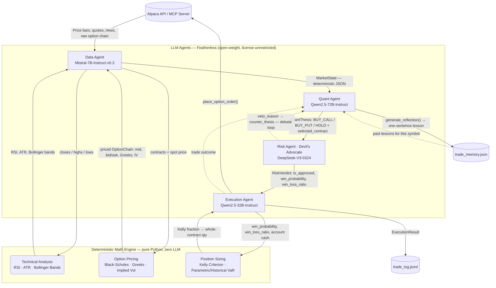
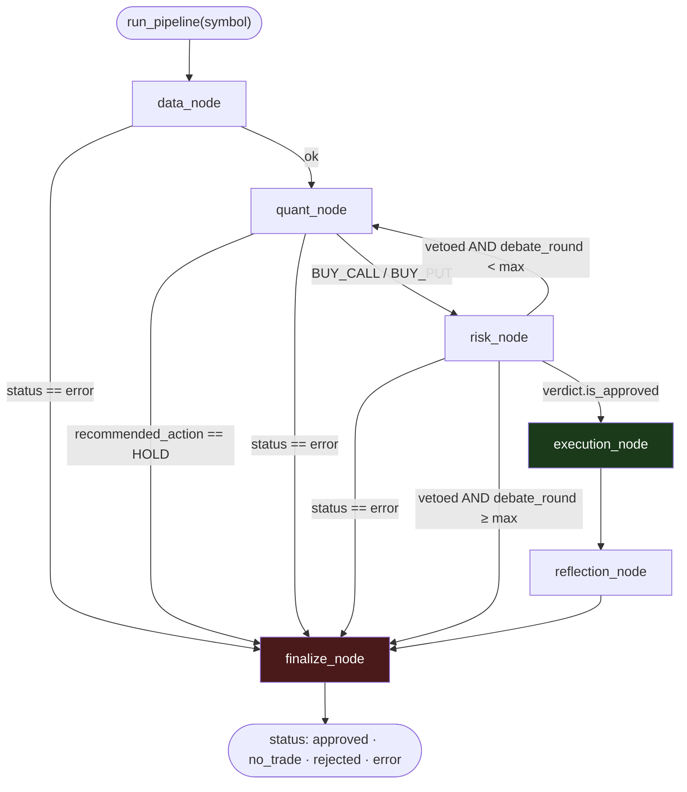

# OrbiTrade — Self-Improving Multi-Agent Options Trading System

**A math-first, autonomous multi-agent LLM system that trades options on Alpaca, debates its own decisions before every trade, and gets better after every one.**

[🌌 Live Demo (Terminal + Math Sandbox)](https://irmak-b.github.io/OrbiTrade/) · [📂 GitHub Repository](https://github.com/irmak-b/OrbiTrade-Self-Improving-Multi-Agent-Options-Trading-System-) · Built for the [Alpaca AI Trading Agents Hackathon](https://lablab.ai/ai-hackathons/alpaca-ai-trading-agents-hackathon) 
Promo Video : (https://www.youtube.com/watch?v=89p2qbwqI8Y&t=5s)

---

## Abstract

The integration of Large Language Models (LLMs) into algorithmic trading presents significant potential, yet pure LLM systems frequently hallucinate numerical computations and lack rigorous risk management. We present **OrbiTrade**, an autonomous, multi-agent LLM system designed specifically for executing options strategies. The core philosophy of this architecture is the **strict separation of deterministic quantitative computation** — utilizing the Black-Scholes model, the Greeks, and the Kelly Criterion — **from qualitative reasoning**, thereby preventing pricing and risk hallucinations. Orchestrated via LangGraph, the system operates through a specialized four-agent pipeline: each agent focuses on a different side of the decision, and each hands the next a structured, validated artifact rather than free text. Furthermore, OrbiTrade achieves continuous improvement **without model retraining** through a post-trade reflection loop that logs trade outcomes and extracts actionable lessons for future contextual recall.

---

## 1. Introduction & Motivation

The potential of LLMs extends beyond generating well-written copy, stories, essays, and programs — they can be framed as powerful general problem solvers (Weng, 2023). This capability has increasingly been applied to trading systems, where LLMs act as trader agents making direct decisions by analyzing news, financial reports, and price data (Xiao et al., 2024). However, the reliability of these systems under scrutiny is limited: going beyond mere prediction to support LLM orchestration with autonomous, *verifiable* decision-making algorithms is what actually improves on existing systems.

**One core problem motivated this project:** how do you feed a general-purpose LLM enough domain-specific financial rigor that it can reason like an options desk, rather than hallucinate one? (Wang et al., 2024). Asking a language model to compute an option's Delta or its own position size is asking it to do arithmetic it was never built to guarantee. OrbiTrade's answer is architectural, not prompt-based: **a dedicated, pure-Python math engine** (Black-Scholes, the Greeks, Kelly Criterion, RSI/ATR/Bollinger Bands) computes every number the system ever acts on. LLMs never see raw prices and never invent a Greek — they receive fully-priced, pre-computed structured data and reason *over* it. Paired with a continuous post-trade feedback mechanism (Self-Reflection), this grounds the LLMs in financial reality while still letting them do what they're actually good at: synthesizing qualitative signal — news, sentiment, macro context — into a structured trading thesis.

At a glance, the pipeline is:

- A **Data Agent** ingests real-time prices, news, and a priced option chain via the official **Alpaca MCP server**.
- A **Quant Agent** (Qwen2.5-72B) synthesizes a directional options thesis (`BUY_CALL` / `BUY_PUT` / `HOLD`), selecting a real contract — strike, expiry, Greeks — from the chain it was handed. It never invents a number.
- A **Risk Agent** (DeepSeek-V3), acting as Devil's Advocate, first runs a **deterministic** Vega/Theta threshold filter, then — if that passes — challenges the thesis in an adversarial LLM debate, producing an approval verdict plus the win-probability / win-loss-ratio inputs Kelly sizing needs.
- An **Execution Agent** (Qwen2.5-32B) applies Kelly-based position sizing capped by a hard portfolio percentage, checks for duplicate positions and market hours, and is the *only* module in the system allowed to call Alpaca's order-placement endpoint.

Every agent's output is a validated Pydantic object, never a loose string — so the pipeline has a typed, checkable contract at every hop, and LangGraph can route on it deterministically.

---

## 2. Related Work

### 2.1 Trading Agents with LLMs

LLM-driven trading agents can be broadly grouped by architectural paradigm: memory-driven, debate-driven, and prediction-driven. Memory-driven systems lean on structured cognitive processes and historical context retention, echoing deliberate reasoning frameworks like Tree of Thoughts (Yao et al., 2023). Debate-driven systems use multi-agent interaction to challenge cognitive bias and improve decision robustness — Xing (2025) shows this for financial sentiment analysis with heterogeneous LLM agents, and Li et al. (2023) introduce **TradingGPT**, a multi-agent system with distinct characters and layered memory. Prediction-driven approaches validate LLMs' capacity to forecast price movement and return predictability directly (Lopez-Lira & Tang, 2026), often built on mathematically capable foundation models such as Qwen (Bai et al., 2023).

**The gap:** existing frameworks employ memory, debate, or prediction — rarely all three, and almost never alongside the strict, formula-driven mathematical constraints that *derivatives* trading actually requires. A Devil's Advocate debate over a stock's direction is one thing; a debate over an option position also has to reason about Theta decay and Vega exposure with numbers that are either exactly right or badly wrong. OrbiTrade addresses this gap by grounding multi-agent debate and reflection *inside* a deterministic mathematical engine rather than around it.

### 2.2 Self-Improving Models

A parallel line of work asks whether an autonomous system can keep improving without retraining. **Voyager** (Wang et al., 2023) continuously explores its environment to build an expanding skill library; language models have been shown to teach themselves to program better via self-generated synthetic feedback (Haluptzok et al.); and models have reached expert-level performance on structured domains like Olympiad geometry with no human demonstrations at all (Trinh et al., 2024). OrbiTrade draws on this line directly: a deterministic **post-trade reflection loop** logs every trade's outcome and distills it into one concrete, reusable lesson, which is re-injected into the Quant Agent's context on every future call for that symbol — continuous strategic refinement in the financial domain, with zero retraining.

---

## 3. System Architecture

### 3.1 Agent Data Flow



### 3.2 Orchestration — LangGraph State Machine

The four agents above are wired into a single, autonomous `StateGraph` with a **bounded Quant ↔ Risk debate loop** and **fail-closed error handling**: any exception anywhere in the pipeline routes straight to `finalize` with `status="error"` — no partial state can ever reach the execution node.



Two independent safety layers have to agree before an order is ever placed: the Risk Agent's deterministic Greek filter **and** its LLM debate verdict, followed by the Execution Agent's own Kelly-sizing and market-hours fail-safes. Both were designed so that "no trade" is always a safe, first-class outcome — not a crash.

---

## 4. The Four Agents
<p align="center">

</p>

| Agent | Model (via Featherless) | Responsibility |
|---|---|---|
| **Data** | `mistralai/Mistral-7B-Instruct-v0.3` | Ingests live prices, quotes, news, and the option chain via the official `alpaca-mcp-server`; hands off a fully-priced `MarketState` — never raw Alpaca JSON — to every downstream agent. |
| **Quant** | `Qwen/Qwen2.5-72B-Instruct` | Synthesizes a directional options thesis over Direction **and** Time **and** Volatility (not direction alone). Selects a real contract from the chain it was given; never fabricates a strike, expiry, or Greek. Revises its own thesis when challenged by the Risk Agent. |
| **Risk (Devil's Advocate)** | `deepseek-ai/DeepSeek-V3-0324` | Runs a deterministic Vega/Theta threshold veto *before* any LLM call; if that passes, argues the strongest opposing case and estimates the win-probability / win-loss-ratio that feed Kelly sizing downstream. Holds final approval power. |
| **Execution** | `Qwen/Qwen2.5-32B-Instruct` | The only module allowed to place an order. Applies Kelly-Criterion sizing capped by a hard portfolio-percentage ceiling, checks market hours and existing positions, and places whole-contract option orders via Alpaca MCP. |

All four share a single `FEATHERLESS_API_KEY` and are routed through one factory (`core/llm_factory.py`), so swapping any model is a one-line change.

---

## 5. Deterministic Math Engine — Zero LLM Hallucination

Every number the agents reason over is computed by pure, unit-tested Python — **never estimated by a language model**:

- **Options pricing:** Black-Scholes pricing, full Greeks (Δ Gamma, Γ, Vega ν, Theta Θ, Rho ρ), and an implied-volatility solver.
- **Technicals:** RSI, ATR, Bollinger Bands, computed on live Alpaca bars.
- **Risk sizing:** Kelly Criterion (fractional, capped), parametric and historical Value-at-Risk.

**35/35 unit tests passing** on the math engine alone — the deterministic core the entire system's credibility rests on is verified independently of any LLM call.

---

## 6. Self-Improvement Loop (Reflection)

OrbiTrade improves **without retraining any model**:

1. **Memory store** — `core/memory.py` persists one structured record per executed trade into `trade_memory.json`.
2. **Lesson extraction** — immediately after `execution_node` attempts an order (approved or rejected), the Quant Agent (`generate_reflection`) distills the full decision cycle — thesis, risk verdict, execution result — into a single, concrete, falsifiable sentence.
3. **Contextual recall** — every subsequent `quant_node` call for that symbol re-reads its lessons and weighs them the way a trader would weigh their own trading journal, not as instructions to blindly follow.

> **Example lesson:** *"High IV environment with Delta > 0.70 led to elevated Theta decay risk; avoid buying expensive OTM calls within one week of an earnings date."*

This closes the loop the related-work section points to: a self-improving agent, grounded in deterministic math rather than free-floating memory.

---

## 7. Risk Gates

| Gate | Method |
|---|---|
| **Position sizing** | Kelly Criterion, hard-capped at `MAX_POSITION_SIZE_PCT` of portfolio cash — no matter what the LLMs suggest. |
| **Volatility filter** | Vega & Theta thresholds enforced **deterministically**, before any LLM debate even runs. |
| **Debate loop bound** | Quant ↔ Risk disagreement is capped at `max_debate_rounds` — it can never loop forever. |
| **Market-hours fail-safe** | Execution Agent checks Alpaca's live clock; a closed market or a clock-tool failure is treated as "don't trade," never as a crash. |
| **Duplicate-position guard** | Existing open positions are checked before every buy to avoid stacking the same contract. |
| **Fail-closed error handling** | Any exception anywhere in the LangGraph pipeline routes straight to `status="error"` — never to a trade with default/guessed values. |

---

## 8. Technology Stack

- **Orchestration:** LangGraph (`StateGraph`)
- **LLM inference:** Featherless AI — Qwen2.5-72B/32B, DeepSeek-V3-0324, Mistral-7B (all open-weight, license-unrestricted)
- **Brokerage:** Alpaca Trading API, via the official `alpaca-mcp-server` (Model Context Protocol, stdio/JSON-RPC — the same protocol Claude Desktop, Cursor, or VS Code use)
- **Math:** NumPy / SciPy — Black-Scholes, Greeks, RSI, ATR, Bollinger, Kelly, VaR
- **Interfaces:** `cli.py` (structured-JSON terminal CLI, script/cron-safe) · Streamlit multi-page dashboard (Live Agent Terminal + Math Engine Sandbox) · a WebGL/Three.js landing page
- **Deployment:** Streamlit Community Cloud (dashboard) + GitHub Pages (landing page) — fully free-tier, zero dedicated servers

---

## 9. Folder Structure

```
OrbiTrade/
├── agents/
│   ├── data_agent.py          # Alpaca MCP -> MarketState, incl. priced option chain
│   ├── quant_agent.py         # Thesis synthesis + self-revision + reflection generation
│   ├── risk_agent.py          # Deterministic Greek filter + Devil's Advocate debate
│   └── execution_agent.py     # Kelly sizing, position cap, places the order
├── core/
│   ├── math_engine.py         # Black-Scholes, Greeks, ATR, RSI, Kelly, VaR
│   ├── schemas.py             # Shared Pydantic contracts between every agent
│   ├── state.py                # LangGraph AgentState
│   ├── llm_factory.py         # Featherless model routing per agent role
│   ├── mcp_client.py           # Real MCP client -- spawns alpaca-mcp-server over stdio
│   ├── alpaca_tools.py         # Alpaca-facing functions, implemented as MCP tool calls
│   └── memory.py               # Self-reflection / lesson storage
├── orchestration/
│   └── graph.py                # LangGraph StateGraph -- the debate loop + fail-closed routing
├── dashboard/
│   ├── app.py                  # Live Agent Terminal (Streamlit)
│   └── pages/
│       └── math_sandbox.py     # Interactive Black-Scholes / Kelly / VaR sandbox
├── docs/                       # WebGL/GSAP landing page (GitHub Pages)
├── cli.py                      # `python cli.py run --symbol AAPL`
├── tests/                      # 70+ unit tests: math engine, agent logic, MCP mapping, graph routing
├── trade_log.jsonl             # Append-only execution log (created at runtime)
├── trade_memory.json           # Reflection / lesson store (created at runtime)
└── requirements.txt
```

---

## 10. Getting Started

```bash
pip install -r requirements.txt
pytest tests/ -v

# Full pipeline for one symbol (spawns the real alpaca-mcp-server;
# needs ALPACA_API_KEY / ALPACA_SECRET_KEY / FEATHERLESS_API_KEY in .env)
python cli.py run --symbol AAPL --verbose

# Paper account / open positions
python cli.py account
python cli.py positions

# Self-reflection lesson store
python cli.py memory --symbol AAPL

# Full interactive dashboard
streamlit run dashboard/app.py
```

`run_pipeline()` / `stream_pipeline()` in `orchestration/graph.py` are the single entry points into the entire system — the CLI, the dashboard, or any future API endpoint all call the exact same function:

```python
from orchestration.graph import run_pipeline
final_state = run_pipeline("AAPL", max_debate_rounds=2)
print(final_state["status"])  # "approved" | "no_trade" | "rejected" | "error"
```

---

## 11. Live Demo

- **Landing page (WebGL/Three.js):** [irmak-b.github.io/OrbiTrade](https://irmak-b.github.io/OrbiTrade/)
- **Live Agent Terminal:** run the full multi-agent pipeline against real Alpaca paper-trading data, in the browser, no local setup
- **Math Engine Sandbox:** interactively explore Black-Scholes pricing, Greeks, and Kelly sizing

---

## 12. Alignment with Hackathon Requirements

| Requirement | Where it's satisfied |
|---|---|
| **Autonomous agents** | End-to-end pipeline, data ingestion → thesis → debate → sizing → order, with zero human intervention once triggered. |
| **Alpaca Trading API** | `core/alpaca_tools.py` — bars, quotes, news, account, positions, option chain, orders. |
| **MCP server** | `core/mcp_client.py` spawns the official `alpaca-mcp-server` and speaks JSON-RPC over stdio. |
| **Alpaca CLI** | `cli.py run / account / positions / memory` — structured JSON, script/cron-safe. |
| **Paper trading** | All orders route through Alpaca's paper environment by default. |
| **Options trading** | Every strategy trades options, never bare equity — `QuantThesis.recommended_action` is restricted to `BUY_CALL \| BUY_PUT \| HOLD`, with no fallback path. |

---

## 13. Status

- [x] **Day 1** — Math engine, 35/35 tests passing
- [x] **Day 2** — Four agents scaffolded, Featherless routing, shared Pydantic schemas
- [x] **Day 3** — Real Alpaca MCP integration (live handshake + tool calls), LangGraph orchestration with bounded debate loop and fail-closed error handling, terminal CLI — 70/70 tests passing
- [x] **Day 4** — Options trading end-to-end (priced chain, Greek-risk veto, whole-contract Kelly sizing) + self-reflection loop (`trade_memory.json`, contextual recall)
- [x] **Day 5** — Streamlit multi-page dashboard (Live Terminal + Math Sandbox), deployed to Streamlit Community Cloud
- [x] **Day 6** — WebGL landing page, GitHub Pages deployment, final integration testing, hackathon submission

---

## References

Bai, J. et al. (2023). *Qwen Technical Report.*
Haluptzok, P. et al. *Language Models Can Teach Themselves to Program Better.*
Li, Y. et al. (2023). *TradingGPT: Multi-Agent System with Layered Memory and Distinct Characters for Enhanced Financial Trading Performance.*
Lopez-Lira, A. & Tang, Y. (2026). *Can ChatGPT Forecast Stock Price Movements? Return Predictability and Large Language Models.*
Trinh, T. et al. (2024). *Solving Olympiad Geometry Without Human Demonstrations.* Nature.
Wang, G. et al. (2023). *Voyager: An Open-Ended Embodied Agent with Large Language Models.*
Wang, S. et al. (2024). *Domain-Specific LLM Adaptation for Financial Reasoning.*
Weng, L. (2023). *LLM Powered Autonomous Agents.*
Xiao, Y. et al. (2024). *Language Agents for Financial Decision-Making.*
Xing, F. (2025). *Designing Heterogeneous LLM Agents for Financial Sentiment Analysis.*
Yao, S. et al. (2023). *Tree of Thoughts: Deliberate Problem Solving with Large Language Models.*

---

## License

MIT — built for and submitted to the [Alpaca AI Trading Agents Hackathon](https://lablab.ai/ai-hackathons/alpaca-ai-trading-agents-hackathon) (lablab.ai).
